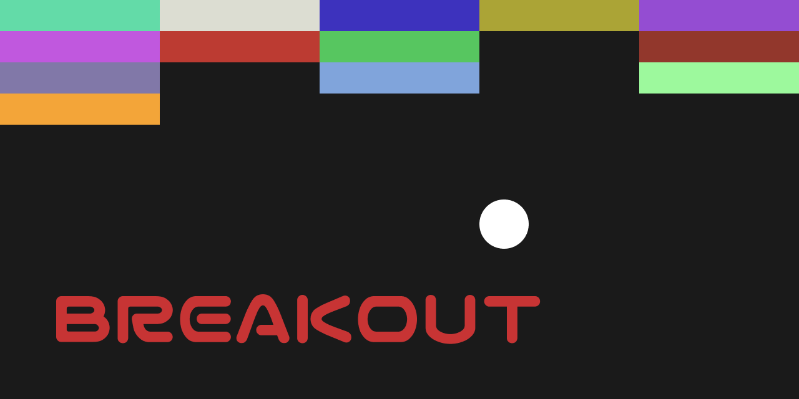
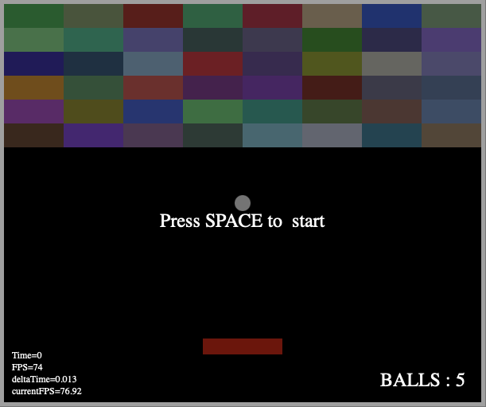
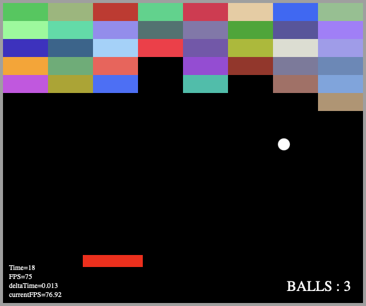

  

# Breakout Game

**Breakout Game** is a web based project that uses the HTML canvas to recreate the famous 70's arcade game by Atari. 
The game allows the player move from one side of the bottom of the screen to the other trying to bounce a ball that will have to destroy every brick of the wall on the top of the screen.

## Features

- **Simplifaied** version of the **game** without any power-ups.

## Screenshots

  
  

## Future Features

At the moment, there are no plans to introduce any new features.

## Requirements

This version of the game works on the browser but only on desktop, not mobile browsers.

## License

This project is licensed under the MIT License.

#

**Breakout Game** is an open-source project developed by Javier Iregui, 2022.
